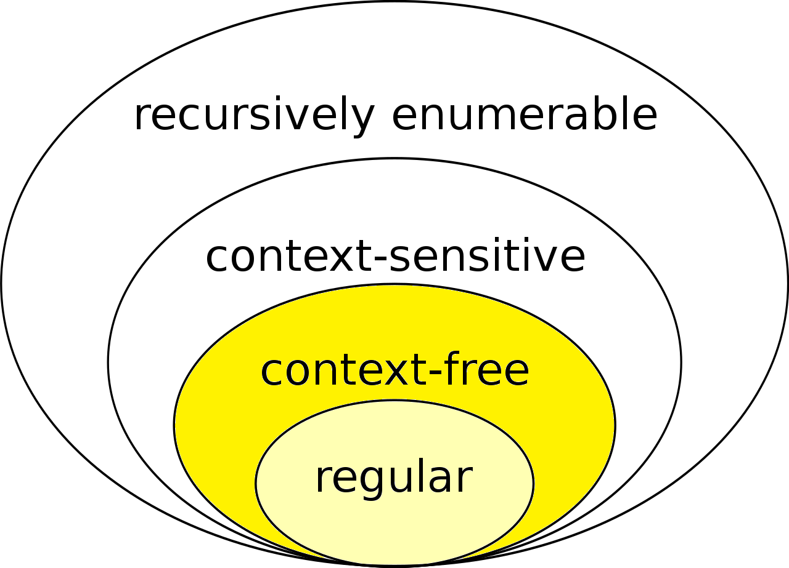

# Grammars and languages

**Generative grammar**
A generative grammar is defined as $G = (V,T,S,P)$ dove:

V = Set of non terminals
T = Set of terminals
S = Start symbol
P = Set of productions

Informally, a generative grammar is used to generate a language $L$, and is composed by a *Vocabulary* and *Productions.*

A **Vocabulary** is a set of symbols, some of which, the *terminals,* are the output of the lexical analysis, and one of the *non-terminals* is the *start-symbol*

**Productions** are a set of conversion and parsing rules for strings, used to obtain the language from the start-symbol

**Language**

A Language $L$  is a set of words, composed by terminals only, that are generated from the vocabulary through productions ****

**Notation (Vocabulary)**

- $A,B,...\in (V\setminus T)$  = non terminals
- $a,b,... \in T$ = terminals
- $\alpha, \beta,... \in V^*$ = string composed of terminals and non
- $w_1,w_2,... \in T^*$ = string composed of terminals
- $\epsilon$  = empty string symbol

**Notation (Productions)**

$\delta \to \beta$  where $\delta \in V^+$ and contains at least one non-terminal

$\delta$  is called *driver* ****of the production while $\beta$ is called *body* of the production

---

## Chomsky hierarchy

<aside>
💡 Different kinds of grammars, with different rules, generate different languages.
To operate and execute those languages we use different types of machines (automations), differing by complexity.

</aside>

The Chomsky hierarchy tells us that analyzing the language we can determine the complexity of the machine that will execute it

---