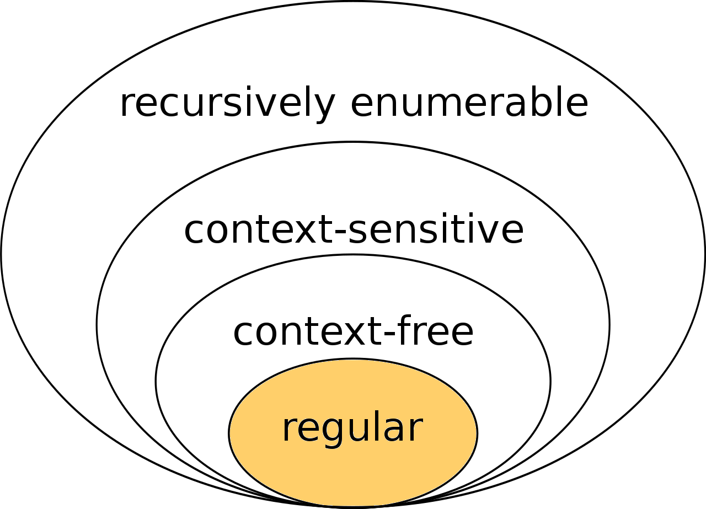

# Regular grammars and languages

# Regular Languages

## Regular Grammar

Regular grammars are free grammars with productions of the form:

- $A  \to a$
- $A \to aB$
- $A \to \epsilon$

## Regular expressions

Fix an alphabet $A$ and a number of operators. 
Then regular expressions can be defined inductively:

Base:

- $\forall \nobreakspace \nobreakspace a \in A$  is a regular expression
- $\epsilon$  is a regular expression

Inductive step:

If  $r_1$ and  $r_2$  are regular expressions then:

- (**Alternation/Union**)       $r_1 |r_2$  is a regular expression
- (**Concatenation**)             $r_1 \cdot r_2$   is a regular expression (also written $r_1 r_2$)
- (**Kleene star**)                   $r_1^*$  is a regular expression
- (**Parenthesis**)                  $(r_1)$ is a regular expression

This inductive definition is used also for defining the language:

**Denoted Language**

Given a regular expression  $r$  over  $A$,  the language denoted by  $r$,  written  $L(r)$,  is also inductively defined on the structure of $r$

Base:

- $L(a) = \{ a\}, \space \forall \nobreakspace a \in A$
- $L(\epsilon) = \{ \epsilon \}$

Inductive step:

- If  $r=r_1 |r_2 \implies L(r)=L(r_1)\nobreakspace \bigcup \nobreakspace L(r_2)$
- If  $r=r_1r_2 \implies L(r)=\{w_1w_2\nobreakspace|\nobreakspace w_1 \in L(r_1)$ and $w_2 \in L(r_2)\}$
- If  $r=r_1^* \implies L(r) = \{\epsilon\} \bigcup\{w_1w_2...w_k\nobreakspace|\nobreakspace k\ge 1$   and   $\forall\nobreakspace i: 1\le i\le k.\nobreakspace w_i \in L(r_1)\}$
- If  $r = (r_1)\implies L(r) = (r_1)$

**Conventions**

Kleene star has the highest precedence
Concatenation has second highest precedence
Alternation has lowest precedence

Example:

$(a \nobreakspace | \nobreakspace bc^*) \implies (a\nobreakspace |\nobreakspace b\nobreakspace(c^*)) \implies (a\nobreakspace | \nobreakspace (b \nobreakspace(c^*)))$

All of them are left-associative