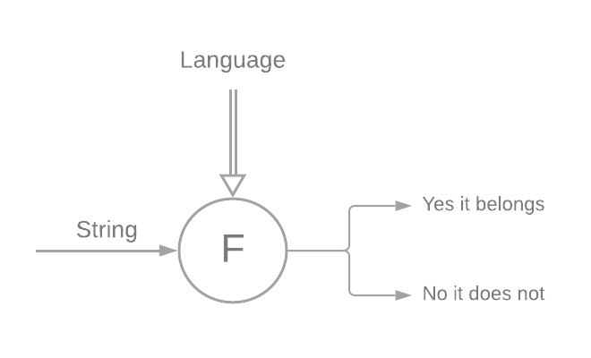
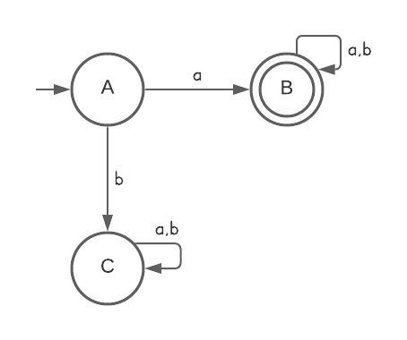
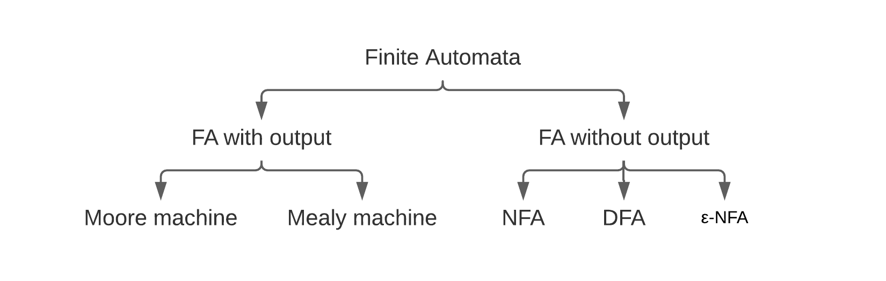

# Theory of Computation

following lectures by Ravindrababu Ravula

<aside>
➡️ [Links to the playlist](https://www.youtube.com/playlist?list=PLEbnTDJUr_IdM___FmDFBJBz0zCsOFxfK)

</aside>

---

### Basics :  Symbol → Alphabet → String → Language

**Symbol -** A symbol is any single letter or character and is the basic building block of this topic

$a, b,c,...,1,0,...☺,☻,...$

$**\text{\textquotedblleft} \Sigma":$  Alphabet -** Some collection of symbols.

$\{a,b\},\{a,b,c\}\{0,1\}\{0,1...9\}$

$|\Sigma| :$  number of symbols in the alphabet

**String -** a sequence of symbols of an alphabet

$a,b$ - example of strings with length 1
 $aa, ab, ba, bb$  -  strings with length 2

From an alphabet with $|\Sigma| = k$ we can generate $k^n$ strings of length = $n$

**Language -** A collection of strings (usually defined with some rules)

Example:

$\Sigma : \{a,b\}$ 

$L_1:$ Set of all strings with length 2

$:\{aa,ab,ba,bb\}$

$L_2:$ Set of all strings starting with $a$

$:\{ a,aa,ab,aab,aba,abb,...\}$

A language can be finite or infinite, while alphabets and strings are finite.

---

### Operations on $\Sigma$

Let's define $\Sigma = \{ a,b\}$

$\Sigma^n :$ (sigma at the power of n) means all the strings generated from $\Sigma$ with length $n$

$\Sigma^2 = \Sigma^1\Sigma^1 = \{a,b\}\{a,b\} = \{aa,ab,ba,bb\}$

$\Sigma^*:$ (sigma star) means the set of all possible strings of all lengths from the alphabet

$=\Sigma^0 \cup \Sigma^1 \cup \Sigma^2 \cup...$ 

---

### Working with strings and languages

Let's suppose that we want to find if a given string $s$ belongs or not to a language $L$.

Let's say that $L$ is *finite*:

$\Sigma=\{a,b\}$

$L_1= \{aa,ab,ba,bb\}$

$s= aaa$

Since the language is finite we can compare each string in the language to $s$.

But what if the language is *infinite:*

$L_2=\{a,aa,ab,aaa,aab,aba,...\}$

$s=babba$

For a human this is pretty intuitive: $L_2$ includes all the strings starting with $a$ and $s$  does not respect that rule.

But for a machine it is much more complicated: it needs to have an algorithm that works for every string and every language, and comparing all the strings of an infinite language is not possible (also because our machines have a finite memory)

So, we need to find a **finite representation $F$** of the language $L$ such as given a string $s$ as input, you can determine if $s$ belongs or not to the language

This finite representation $F$ is what we define as **Finite Automata**

---

### Example and some definitions of Finite Automata

Let's define: 

$L=$  set of all strings starting with $a = \{a,aa,ab,aaa,aab,...\}$

Then its finite representation is:

Where the circles are called **states**

The circle with an incoming arrow, not coming from an another state, is the **initial state**

The double circles are called **final states**

Analyzing the path taken by the FA (finite automata) following the symbols of the given string we can determine whether it ends on a *final state* ( and answer "Yes, it belongs to the language") or not

---

### Hierarchy of Finite Automatons

---

## DFA: Deterministic Finite Automata

A DFA is defined as:

$(Q, \Sigma, \delta, q_0, F)$

Let's see an example to understand better this:

$Q:$ finite set of states → $\{A,B,C\}$

$\Sigma:$ input alphabet → $\{a,b\}$

$q_0:$ start state → $A$

$F:$  set of final states → $\{B\}$

$\delta:$  transition function → $Q\times\Sigma \to Q$ → given a state and a symbol of the alphabet it return a state 

in this case we define $\delta$ as: 

$\{A,B,C\}\times\{a,b\}$

In a DFA **for every couple (state, input** **symbol)** there is **exactly one transition** (arrow in the image)

In an NFA instead there can be more or none transitions for a (state, input) couple.

A **final state** is a state where we accept the string, it has production like each other state in fact it is also called **accepting state.**

**String accept:**

We say that a string is accepted by a DFA if, after **scanning the whole string**, we get to a **final (accepting) state**.

**Language accept:**

We say that a DFA accepts a language if **for each string in the language** **are accepted** (lead to a final state) **AND**  each **string not in the language is rejected.**

---

### Example:

- **Construct a DFA that accepts set of all strings over $\Sigma=\{a,b\}$ of length 2**
    
    $L=\{aa,ab,ba,bb\}$
    
    Let's do it by steps:
    
    First thing to do is to pick one of the simpler (for this example, usually we pick the more complex if the language is finite, and the simple if the language is infinite) element in our language (in this case we chose $aa$) and make an [incomplete] DFA out of it
    
    
    
    Then we need to complete  the productions for each state, since each one of them must have one transition for each symbol in the alphabet.
    
    
    
    Ok, now we have accepted all the strings of length 2, but we notice that C hasn't any production. A production on C would mean a third (or more) symbol in the string.
    Since we do not want to accept it, on those production we have to get to a fourth and not-final state.
    
    
    

---

## About minimal-DFA

For each language we have an infinite number of DFAs, but only one min-DFA (with the lowest possible number of states).

**Minimum number of states :**

Assume $\Sigma=\{a,b\},$ 

$w:$ any string from $\Sigma,$ 

$|w|:$ length of $w$

$|Q|:$ number of states

$|w|=2$

$|w|=n$

min-$|Q|=n+2$

$|w|\ge2$

$|w|\ge n$

min-$|Q|=n+1$

$|w|\le2$

$|w|\le n$

min-$|Q|=n+2$

---

At this point prof. Ravula does many examples, from simple to more complex ones. I am not going to summarize them all, because many of them are pretty easy and more difficult to represent here than to learn.
I strongly suggest to watch the full playlist of prof. Ravula. It is about 17h total, but many exercises are in short videos that are very useful and easy to understand

---