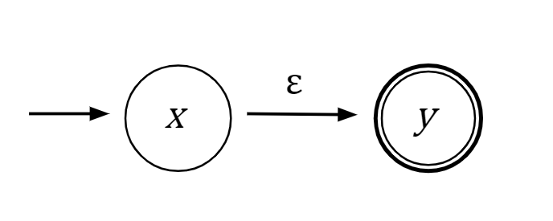
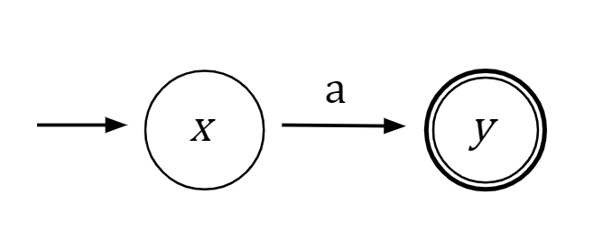
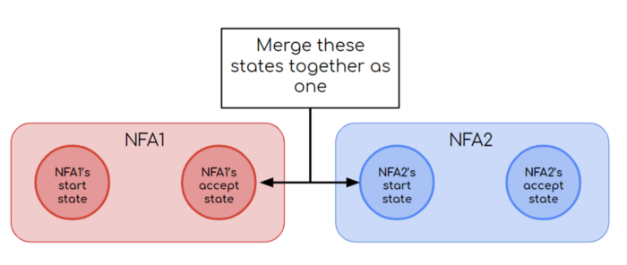
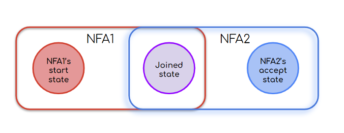
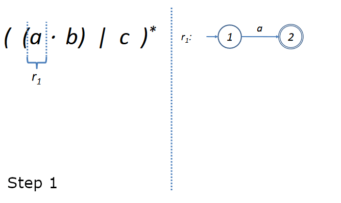

# Thompson's construction algorithm

Used to obtain an NFA from a regular expression 

→Epsilon closure: $\epsilon$-closure({$t$})

is the set of states in $S$ that are reachable from the state $t$ by a number of $\epsilon$-transitions

To apply the Thompson's construction algorithm we analyze the regular expression (string) $s$ by considering it's components in the order determined by precedences. Basically we start considering single chars and then the composition of them.

**Rules**:

— **Empty expression: $s=\epsilon$.**

Means: from the state x, with an $\epsilon$-production (encountering the epsilon value) we get to the (final) state y.

— **A symbol, such: $s=a$ or $s=b$**

Means: from the state x, with an $a$-production (encountering the value $a$) we get to the (final) state y.

— **Alternation: $s = a\space| \space b$**

NFA1 (red) and NFA2 (blue) consists of the two NFAs already created for the symbols $a$ and $b$ (obviously those symbols can be complex expressions)

— **Concatenation: $s=ab$**

Where NFA1 stands for the NFA created for $a$ and NFA2 for the one of $b$

— **Kleene star: $s=a^*$**

Kleene star means zero or more times the symbol which is applied to (in red), so we need to consider the possibility of the transition from x to y through NFA1 zero, one or more times.

**Here we have a visualization of the algorithm applied:**

